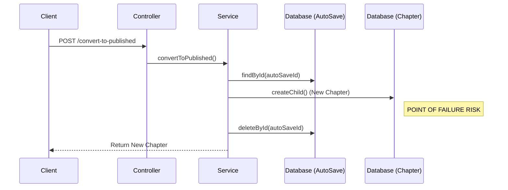

# API Review: Chapter AutoSave Conversion (Detailed Analysis)

## 1. Executive Summary

The `AutoSaveConversionService` handles the critical transition from "temporary work" to "permanent content". While functional, the current implementation lacks **transactional integrity**, exposing the system to data inconsistency risks (duplicate chapters). It also has a significant **feature gap** regarding updating existing chapters.

## 2. Architecture & Data Flow

### Current Flow (Non-Atomic)

The current process performs two distinct database operations without a transaction wrapper.



**The Risk**: If the server crashes or the DB connection is lost at the "POINT OF FAILURE RISK" marker:

1.  The **Chapter** has been created.
2.  The **AutoSave** is NOT deleted.
3.  The Client receives a 500 error (or timeout).
4.  The User retries the operation.
5.  **Result**: Two identical chapters exist in the database.

## 3. Detailed Loophole Analysis

### 3.1. 💥 Loophole: Duplicate Data Generation (Atomicity Violation)

**Location**: `AutoSaveConversionService.performConversion`
**Severity**: **Critical**
**Code Analysis**:

```typescript
// Current Code
const chapter = await this.createChapterFromAutoSave(autoSave, userId, status);
// <--- Crash here leaves zombie data
await this.chapterAutoSaveRepo.deleteById(autoSaveId);
```

**Impact**:

- Corrupted Story Trees (duplicate branches).
- User confusion ("Why do I see two versions of Chapter 5?").
- Analytics skew (double counting reads/votes on duplicates).

### 3.2. 🚫 Loophole: "Update" Dead End

**Location**: `AutoSaveConversionService.createChapterFromAutoSave`
**Severity**: **High**
**Code Analysis**:

```typescript
case 'update_chapter':
  throw this.throwBadRequest('Cannot convert update_chapter autosave. Use the chapter update API instead.');
```

**Impact**:

- **Broken User Workflow**: Users expecting to "Publish" their draft edits via the same button will face an error.
- **Frontend Complexity**: The frontend must implement two completely different logic paths:
  1.  If `isNew`: Call `/convert-to-published`.
  2.  If `isEdit`: Fetch autosave content -> Call `PATCH /chapters/:id` -> Delete autosave.

### 3.3. 👻 Loophole: Orphaned Parent Reference

**Location**: `createChildChapterFromAutoSave`
**Severity**: **Medium**
**Analysis**:
The code validates that `parentChapterSlug` exists _in the autosave object_, but it relies on `chapterCrudService.createChild` to check if the parent _actually exists_ in the DB.
If `chapterCrudService` throws a 404, the conversion fails (correct behavior).
**However**, if the parent chapter was **Soft Deleted** in the meantime:

- `countSiblings` might behave unpredictably depending on filter criteria.
- The new chapter might attach to a "ghost" branch.

### 3.4. � Security Gap: RBAC Context Loading

**Location**: `loadStoryContextFromAutoSave` (Middleware)
**Severity**: **Low**
**Analysis**:
The middleware successfully loads the `storyId` to perform `canWriteChapters` checks. This is good.
**However**, it assumes `autoSave.storyId` is valid. If a malicious user manually creates an autosave pointing to a restricted story ID (via a vulnerability in `AutoSaveContent`?), they might try to trigger a conversion.
_Mitigation_: The `verifyOwnership` check in the service prevents converting others' autosaves, but ensuring `storyId` consistency between the autosave and the actual story context is crucial.

## 4. Recommended Solutions

### 4.1. Fix: Transactional Conversion (Atomic)

Use Mongoose Sessions to ensure all-or-nothing execution.

```typescript
// src/features/chapterAutoSave/services/autosave-conversion.service.ts

private async performConversion(
    autoSaveId: string,
    userId: string,
    status: ChapterStatus
): Promise<IChapter> {
    const session = await mongoose.startSession();
    session.startTransaction();

    try {
        // 1. Fetch & Validate
        const autoSave = await this.chapterAutoSaveRepo.findById(autoSaveId, { session });
        if (!autoSave) throw this.throwNotFoundError('Auto-save not found.');
        this.verifyOwnership(autoSave, userId);

        // 2. Create Chapter (Pass Session!)
        // Note: You need to update createChapterFromAutoSave and createChild/Root
        // to accept IOperationOptions with session.
        const chapter = await this.createChapterFromAutoSave(
           autoSave,
           userId,
           status,
           { session } // Pass session down
        );

        // 3. Delete AutoSave
        await this.chapterAutoSaveRepo.deleteById(autoSaveId, { session });

        await session.commitTransaction();
        return chapter;
    } catch (error) {
        await session.abortTransaction();
        throw error;
    } finally {
        session.endSession();
    }
}
```

### 4.2. Fix: Support Chapter Updates

Modify the service to handle `update_chapter` instead of throwing an error.

```typescript
// Inside createChapterFromAutoSave switch
case 'update_chapter':
    if (!autoSave.chapterId) throw this.throwBadRequest('Original chapter ID missing');

    // Call CRUD update
    const updated = await this.chapterCrudService.update(
        autoSave.chapterId.toString(),
        {
            content: autoSave.content,
            title: autoSave.title, // if allows title updates
            status: status // Update status if needed (e.g. Draft -> Published)
        },
        { session: options.session }
    );
    return updated!;
```

### 4.3. Fix: Unified Endpoint

Instead of separate endpoints for Draft/Published, use a status flag.

**Request**:
`POST /api/v1/autosaves/convert`

```json
{
  "autoSaveId": "...",
  "targetStatus": "PUBLISHED" // or "DRAFT"
}
```

This reduces code duplication in the Controller and makes the API surface cleaner.
