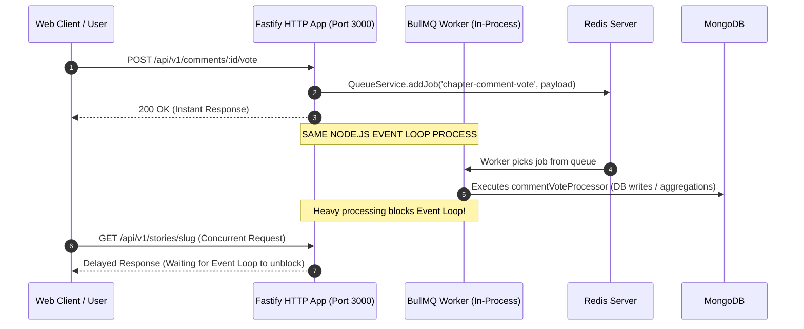
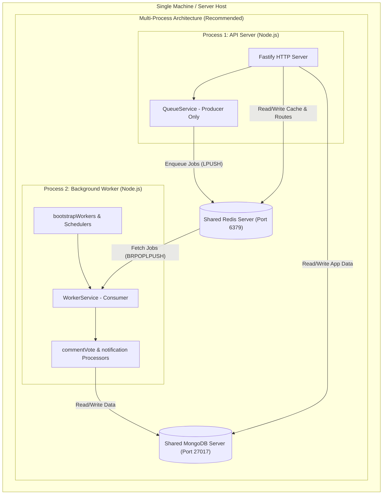

# Background Jobs & Process Separation Architecture

> **Document Version**: 1.0.0  
> **Target System**: StoryChain Backend (`storychain-be`)  
> **Infrastructure Folder**: `src/infrastructure/`  
> **Last Updated**: July 2026  

---

## Table of Contents

1. [Executive Summary](#executive-summary)
2. [Current Architecture Deep Dive (`src/infrastructure`)](#current-architecture-deep-dive-srcinfrastructure)
   - [Core Infrastructure Components](#core-infrastructure-components)
   - [Current Execution & Bootstrap Flow](#current-execution--bootstrap-flow)
3. [The Single-Process Performance Bottleneck Problem](#the-single-process-performance-bottleneck-problem)
   - [Why API Requests Lag When Queues Run in the Same Process](#why-api-requests-lag-when-queues-run-in-the-same-process)
   - [Node.js Single-Threaded Event Loop Mechanics](#nodejs-single-threaded-event-loop-mechanics)
   - [Resource Contention Factors](#resource-contention-factors)
4. [Multi-Process Architecture on a Single Machine](#multi-process-architecture-on-a-single-machine)
   - [Architectural Blueprint](#architectural-blueprint)
   - [Single Process Monolith vs. Multi-Process Model](#single-process-monolith-vs-multi-process-model)
5. [Step-by-Step Refactoring & Implementation Guide](#step-by-step-refactoring--implementation-guide)
   - [Step 1: Decouple Worker Bootstrapping from `app.ts`](#step-1-decouple-worker-bootstrapping-from-appts)
   - [Step 2: Create Dedicated Worker Entrypoint (`src/worker.ts`)](#step-2-create-dedicated-worker-entrypoint-srcworkerts)
   - [Step 3: Update `package.json` Commands](#step-3-update-packagejson-commands)
   - [Step 4: Single-Machine Process Management (PM2 & Docker)](#step-4-single-machine-process-management-pm2--docker)
6. [BullMQ Advanced Isolation & Concurrency Strategies](#bullmq-advanced-isolation--concurrency-strategies)
   - [BullMQ Sandboxed Processors (Child Processes)](#bullmq-sandboxed-processors-child-processes)
   - [Worker Concurrency & Rate Limiting Guidelines](#worker-concurrency--rate-limiting-guidelines)
   - [Redis Connection Management Across Processes](#redis-connection-management-across-processes)
7. [Observability, Bull-Board & Operational Health](#observability-bull-board--operational-health)
8. [Summary & Action Plan](#summary--action-plan)

---

## Executive Summary

The `storychain-be` application utilizes **BullMQ** on top of **Redis** for asynchronous job queueing, batch processing, and cron-based scheduling. 

Currently, both the HTTP API server (Fastify) and the background queue consumers (BullMQ Workers & Schedulers) run within **a single Node.js process on a single machine**. While this setup simplifies development, it leads to severe request latency spikes under load. Because Node.js executes JavaScript on a single thread (the Event Loop), long-running or CPU-heavy background tasks block incoming API requests.

This document outlines the existing queue architecture in `src/infrastructure/` and presents an architectural solution for **Process Separation on a Single Host Machine**. By decoupling the API HTTP server process from the Worker background process while sharing the underlying Redis and MongoDB instances, API response times remain fast and deterministic regardless of background job workloads.

---

## Current Architecture Deep Dive (`src/infrastructure`)

The background job system is located inside `src/infrastructure/` and uses `tsyringe` for Dependency Injection (DI).

### Core Infrastructure Components

```
src/infrastructure/
├── queue/
│   ├── queue.types.ts           # Type definitions for job payloads, queue names & results
│   ├── queue.service.ts         # Type-safe Queue Producer service (adds jobs to Redis)
│   ├── worker.service.ts        # Type-safe Worker Consumer service (manages BullMQ Workers)
│   ├── worker.bootstrap.ts      # Bootstraps workers and scheduled cron jobs
│   └── index.ts                 # Re-exports queue services & constants
├── scheduler/
│   ├── scheduler.service.ts     # Wrapper around QueueService for repeatable/cron jobs
│   └── index.ts                 # Re-exports scheduler service
├── processors/
│   ├── commentVote.processors.ts# Processor logic for comment vote sync & aggregations
│   └── notification.processors.ts # Processor logic for constructing and dispatching notifications
└── domains/
    └── chapterCommentVote.queue.ts # Domain queue wrapper for comment vote queue ops
```

#### 1. `QueueService` (`src/infrastructure/queue/queue.service.ts`)
- **Role**: Producer service `@singleton()`.
- **Function**: Manages BullMQ `Queue` instances. Exposes strongly-typed methods like `addJob()`, `addBulkJobs()`, and `addScheduledJob()`.
- **Registered Queues**:
  - `QUEUE_NAMES.NOTIFICATION` (`'notification'`)
  - `QUEUE_NAMES.EMAIL` (`'email'`)
  - `QUEUE_NAMES.CHAPTER_COMMENT_VOTE` (`'chapter-comment-vote'`)

#### 2. `WorkerService` (`src/infrastructure/queue/worker.service.ts`)
- **Role**: Consumer service `@singleton()`.
- **Function**: Registers BullMQ `Worker` instances using `registerWorker()`. Attaches event listeners for `completed`, `failed`, and `error` telemetry. Handles graceful shutdown with `closeAll()`.

#### 3. `SchedulerService` (`src/infrastructure/scheduler/scheduler.service.ts`)
- **Role**: Cron / Repeatable Job Manager `@singleton()`.
- **Function**: Wraps `QueueService.addScheduledJob()` to register cron-based recurring tasks (e.g., periodic vote count synchronization).

#### 4. Processors (`src/infrastructure/processors/`)
- `commentVoteProcessor`: Handles comment vote batching, vote removal, and database aggregations.
- `notificationProcessor`: Calls `NotificationFactory` to build and save notification records in MongoDB.

---

### Current Execution & Bootstrap Flow

Currently, in `src/app.ts`, both HTTP routing and background job worker bootstrapping occur within the exact same lifecycle:

```typescript
// Excerpt from src/app.ts
await registerRoutes(app);

await bootstrapSchedulers(); // Enqueues sync-counts repeatable jobs
bootstrapWorkers();          // Instantiates Workers on the current process

await app.register(serverAdapter.registerPlugin(), {
  prefix: '/admin/queues',
});
```

#### Monolithic In-Process Flow Diagram



---

## The Single-Process Performance Bottleneck Problem

### Why API Requests Lag When Queues Run in the Same Process

When a client sends an HTTP request (e.g., loading a story or reading a chapter), Fastify must parse the HTTP payload, execute middleware (Clerk authentication, CORS, rate limiting), query MongoDB, and serialize the JSON response.

When a background job processor runs in the **same Node.js process**:

1. **JavaScript is Single-Threaded**: Node.js executes application code on a single thread (the Event Loop).
2. **CPU-Intensive Tasks Block the Loop**: Processing heavy array transformations, JSON parsing/serializing, diff computations, or DB aggregations in a worker function occupies the main thread.
3. **Synchronous Tasks Delay HTTP Handling**: While the main thread processes a worker job, Fastify **cannot** handle incoming HTTP requests or respond to open sockets. The OS kernel queues incoming TCP packets, introducing latency.

### Node.js Single-Threaded Event Loop Mechanics

```
                 +-------------------------------------------------+
                 |            Main Node.js Event Loop              |
                 +-------------------------------------------------+
                                          |
        +---------------------------------+---------------------------------+
        |                                                                   |
        v                                                                   v
+-------------------------------+                         +-------------------------------+
|     Fastify HTTP Handlers     |                         |     BullMQ Worker Processors    |
| - Authentication Middleware   |   COMPETE FOR THE SAME  | - Comment Vote Aggregations   |
| - Route Handlers              | ===== EVENT LOOP =====  | - Notification Generation     |
| - JSON Parsing & Response     |      SINGLE THREAD      | - Email Sending               |
+-------------------------------+                         +-------------------------------+
```

### Resource Contention Factors

Running both API handlers and background workers in one process creates four primary bottlenecks:

| Bottleneck | Description | Impact on API Users |
| :--- | :--- | :--- |
| **Event Loop Delay** | Synchronous JavaScript in workers prevents the Event Loop from processing I/O callbacks. | High `p99` latency spikes on HTTP endpoints. |
| **Garbage Collection (GC) Pauses** | Worker jobs creating transient objects force V8 GC cycles. | Sudden 50ms - 500ms freezes across all endpoints. |
| **Redis Connection Contention** | BullMQ workers poll Redis for jobs on the same connection pool used for rate limiting & cache. | Rate-limiter timeouts or delayed cache retrieval. |
| **MongoDB Connection Pool** | Database queries in worker jobs consume pool connections allocated for HTTP handlers. | Connection pool exhaustion errors (`MongoServerSelectionError`). |

---

## Multi-Process Architecture on a Single Machine

To solve this without needing multiple servers, you can run **separate OS processes on a single physical host / machine**.

### Architectural Blueprint

By splitting the codebase into two entrypoints:
1. **API Server Process (`src/server.ts`)**: Initializes Fastify, registers HTTP routes, handles client connections, and acts purely as a **Queue Producer** (adding jobs to Redis).
2. **Worker Process (`src/worker.ts`)**: Connects to Redis & MongoDB, bootstraps DI container, and acts purely as a **Queue Consumer** (`WorkerService`, `bootstrapWorkers()`, `bootstrapSchedulers()`).

Both processes run on the **same machine**, sharing local Redis and MongoDB instances via IPC/loopback network sockets.

### Single Process Monolith vs. Multi-Process Model



---

## Step-by-Step Refactoring & Implementation Guide

### Step 1: Decouple Worker Bootstrapping from `app.ts`

Modify `src/app.ts` so that it only initializes the Fastify HTTP application and Bull-Board monitoring UI. Remove worker/scheduler bootstrapping from the HTTP application factory.

#### Modified `src/app.ts`

```typescript
// src/app.ts
import Fastify from 'fastify';
import cors from '@fastify/cors';
import helmet from '@fastify/helmet';
import { env } from '@config/env';
import { registerRoutes } from '@routes/index';
import { globalErrorHandler } from '@middleware/errorHandler';
import { clerkPlugin } from '@clerk/fastify';
import 'dotenv/config';
import fastifySwagger from '@fastify/swagger';
import fastifySwaggerUi from '@fastify/swagger-ui';
import rateLimit from '@fastify/rate-limit';
import { container } from 'tsyringe';
import { RedisService } from './config/services';
import { TOKENS } from './container';
import { FastifyRequest } from 'fastify';
import { ApiError } from './utils/apiResponse';
import fastifyMetrics from 'fastify-metrics';
import { FastifyAdapter } from '@bull-board/fastify';
import { createBullBoard } from '@bull-board/api';
import { QUEUE_NAMES, QueueService } from './infrastructure';
import { BullMQAdapter } from '@bull-board/api/bullMQAdapter';
import { logger } from './utils/logger';

export const createApp = async () => {
  const redisService = container.resolve<RedisService>(TOKENS.RedisService);
  const queueService = container.resolve<QueueService>(TOKENS.QueueService);

  const app = Fastify({
    logger: env.NODE_ENV === 'development',
    trustProxy: true,
  });

  // Register plugins
  await app.register(cors, {
    origin: true,
    methods: ['GET', 'POST', 'PUT', 'DELETE', 'PATCH', 'OPTIONS'],
    credentials: true,
  });
  await app.register(helmet);
  await app.register(clerkPlugin);
  await app.register(fastifyMetrics);

  // Bull Board Admin UI Configuration
  const serverAdapter = new FastifyAdapter();
  serverAdapter.setBasePath('/admin/queues');

  const queues = [
    QUEUE_NAMES.CHAPTER_COMMENT_VOTE,
    QUEUE_NAMES.EMAIL,
    QUEUE_NAMES.NOTIFICATION,
  ].map((name) => new BullMQAdapter(queueService.getQueue(name)));

  createBullBoard({
    queues,
    serverAdapter,
    options: {
      uiConfig: {
        boardTitle: 'StoryChain Queues Dashboard',
      },
    },
  });

  await app.register(rateLimit, {
    global: true,
    max: 50,
    timeWindow: '1 minute',
    redis: redisService.getClient(),
    keyGenerator: (request: FastifyRequest): string => {
      return request.user?.clerkId ?? request.ip ?? 'unknown';
    },
    errorResponseBuilder: (_request: FastifyRequest, context) => {
      return ApiError.tooManyRequests(
        'RATE_LIMIT_EXCEEDED',
        `You've made too many requests in a short period. Please try again after ${context.after}.`
      );
    },
  });

  // Register Swagger & Swagger UI
  await app.register(fastifySwagger, { /* swagger config */ });
  await app.register(fastifySwaggerUi, { routePrefix: '/docs' });

  // Health check endpoint
  app.get('/health', async () => ({ status: 'ok', process: 'api' }));

  // Register API routes
  await registerRoutes(app);

  // Mount Bull-Board UI
  await app.register(serverAdapter.registerPlugin(), {
    prefix: '/admin/queues',
  });

  // Global Error handler
  const isDevelopment = env.NODE_ENV !== 'production';
  app.setErrorHandler(globalErrorHandler(isDevelopment));

  return app;
};
```

---

### Step 2: Create Dedicated Worker Entrypoint (`src/worker.ts`)

Create a dedicated entrypoint `src/worker.ts` that runs exclusively as the background queue consumer.

```typescript
// src/worker.ts
import 'reflect-metadata';
import 'dotenv/config';
import { container, TOKENS } from '@container/index';
import type { DatabaseService } from '@config/services/database.service';
import type { RedisService } from '@config/services/redis.service';
import { bootstrapSchedulers, bootstrapWorkers } from '@infrastructure/queue/worker.bootstrap';
import { WorkerService } from '@infrastructure/queue/worker.service';
import { logger } from '@utils/logger';

async function startWorkerProcess() {
  logger.info('⚙️ Starting Dedicated Background Worker Process...');

  try {
    // 1. Connect to Database & Redis
    const databaseService = container.resolve<DatabaseService>(TOKENS.DatabaseService);
    await databaseService.connect();
    logger.info('✅ Worker Process connected to MongoDB');

    const redisService = container.resolve<RedisService>(TOKENS.RedisService);
    await redisService.connect();
    logger.info('✅ Worker Process connected to Redis');

    // 2. Bootstrap Cron Schedulers & BullMQ Workers
    await bootstrapSchedulers();
    bootstrapWorkers();

    logger.info('🚀 Background Worker Process is running and consuming jobs.');

    // 3. Graceful Shutdown Handling
    const gracefulShutdown = async (signal: string) => {
      logger.info(`Received ${signal}. Shutting down worker process gracefully...`);
      try {
        const workerService = container.resolve<WorkerService>(TOKENS.WorkerService);
        await workerService.closeAll();
        await redisService.disconnect();
        await databaseService.disconnect();
        logger.info('✅ Worker process shut down cleanly.');
        process.exit(0);
      } catch (err) {
        logger.error('❌ Error during worker shutdown:', err);
        process.exit(1);
      }
    };

    process.on('SIGTERM', () => gracefulShutdown('SIGTERM'));
    process.on('SIGINT', () => gracefulShutdown('SIGINT'));

  } catch (error) {
    logger.error('❌ Fatal error in Worker Process:', error);
    process.exit(1);
  }
}

startWorkerProcess();
```

---

### Step 3: Update `package.json` Commands

Add explicit NPM scripts in `package.json` to launch the API server and Worker process separately or concurrently.

```json
{
  "scripts": {
    "dev:api": "cross-env NODE_ENV=development nodemon --watch src --ext ts --exec tsx src/server.ts",
    "dev:worker": "cross-env NODE_ENV=development nodemon --watch src --ext ts --exec tsx src/worker.ts",
    "dev:all": "concurrently -n \"API,WORKER\" -c \"cyan.bold,magenta.bold\" \"npm run dev:api\" \"npm run dev:worker\"",
    "build": "tsc && tsc-alias",
    "start:api": "cross-env NODE_ENV=production node dist/server.js",
    "start:worker": "cross-env NODE_ENV=production node dist/worker.js"
  }
}
```

---

### Step 4: Single-Machine Process Management (PM2 & Docker)

To run both processes reliably on a single production server, use a process manager like **PM2** or **Docker Compose**.

#### Option A: PM2 Deployment (`ecosystem.config.js`)

PM2 allows running the API across multiple CPU cores in **Cluster Mode** while running the Worker process in **Fork Mode** on a dedicated core—all on the same machine.

Create `ecosystem.config.js` in the project root:

```javascript
// ecosystem.config.js
module.exports = {
  apps: [
    {
      name: 'storychain-api',
      script: './dist/server.js',
      instances: 'max',       // Cluster mode across available CPU cores minus 1
      exec_mode: 'cluster',
      env: {
        NODE_ENV: 'production',
        PORT: 3000,
      },
      max_memory_restart: '1G',
    },
    {
      name: 'storychain-worker',
      script: './dist/worker.js',
      instances: 1,           // Single dedicated process for workers
      exec_mode: 'fork',
      env: {
        NODE_ENV: 'production',
      },
      max_memory_restart: '1.5G',
      autorestart: true,
    },
  ],
};
```

**PM2 Commands for Single Machine**:
```bash
# Build TypeScript
npm run build

# Start both API and Worker processes
pm2 start ecosystem.config.js

# Monitor process CPU & memory usage
pm2 monit

# View logs per process
pm2 logs storychain-api
pm2 logs storychain-worker
```

---

#### Option B: Docker Compose Process Separation (`docker-compose.yml`)

If deploying via Docker on a single host machine, define separate containers sharing the same Redis and Mongo services:

```yaml
version: '3.8'

services:
  api:
    build: .
    command: npm run start:api
    ports:
      - "3000:3000"
    environment:
      - NODE_ENV=production
      - REDIS_HOST=redis
      - MONGO_URI=mongodb://mongo:27017/storychain
    depends_on:
      - redis
      - mongo

  worker:
    build: .
    command: npm run start:worker
    environment:
      - NODE_ENV=production
      - REDIS_HOST=redis
      - MONGO_URI=mongodb://mongo:27017/storychain
    depends_on:
      - redis
      - mongo

  redis:
    image: redis:7-alpine
    ports:
      - "6379:6379"

  mongo:
    image: mongo:7.0
    ports:
      - "27017:27017"
```

---

## BullMQ Advanced Isolation & Concurrency Strategies

### BullMQ Sandboxed Processors (Child Processes)

If a background job requires heavy synchronous computation (such as parsing huge chapter diffs or processing images/media), running it on the main worker event loop can still block that worker thread.

BullMQ provides **Sandboxed Processors**, which execute job logic in separate Node.js child processes.

#### Converting a Worker to a Sandboxed Processor

Instead of passing an inline function to `registerWorker`:

```typescript
// src/infrastructure/processors/commentVote.sandboxed.ts
import { Job } from 'bullmq';
import { container } from 'tsyringe';

// Sandboxed process file exports a default async function
export default async function (job: Job) {
  // Heavy CPU work performed here inside an isolated child process
  return { success: true, processedAt: new Date() };
}
```

In `worker.service.ts`, reference the processor file path:
```typescript
import path from 'path';

const sandboxedProcessorPath = path.join(__dirname, '../processors/commentVote.sandboxed.js');

const worker = new Worker(queueName, sandboxedProcessorPath, {
  connection: this.redisService.getClient().options,
  concurrency: 4, // Runs up to 4 child processes in parallel
});
```

---

### Worker Concurrency & Rate Limiting Guidelines

In `src/infrastructure/queue/worker.bootstrap.ts`, configure concurrency based on job profile:

```typescript
export function bootstrapWorkers(): void {
  const workerService = container.resolve<WorkerService>(TOKENS.WorkerService);

  // 1. High I/O, low CPU (e.g. notifications/emails) -> Higher concurrency
  workerService.registerWorker(QUEUE_NAMES.NOTIFICATION, notificationProcessor, 5);

  // 2. High DB writes / aggregations -> Managed concurrency to prevent DB connection locks
  workerService.registerWorker(QUEUE_NAMES.CHAPTER_COMMENT_VOTE, commentVoteProcessor, 2);
}
```

---

### Redis Connection Management Across Processes

When process separation is implemented, ensure Redis connections are configured properly:

1. `maxRetriesPerRequest: null`: Required by BullMQ for blocking queue pops (`BRPOPLPUSH`).
2. `enableReadyCheck: false`: Recommended for BullMQ stability under high throughput.
3. Separate ioredis instances for API Rate-Limiter vs. BullMQ Queue Producer vs. BullMQ Worker Consumer.

---

## Observability, Bull-Board & Operational Health

Even when background workers run in a separate process (`src/worker.ts`), the **Bull-Board UI** mounted at `/admin/queues` in `src/app.ts` continues to function seamlessly.

Because Bull-Board reads job state directly from Redis queues, the API process can monitor queue metrics (active, completed, delayed, failed jobs) without executing worker jobs.

```
+------------------+         +----------------+         +-------------------+
|  API Process     |         |  Redis Server  |         |  Worker Process   |
| (Hosts Dashboard)| ------> | (Stores Queues | <------ | (Executes Jobs &  |
| /admin/queues    | Read    |  & Job Data)   | Updates |  Updates Status)  |
+------------------+ Metrics +----------------+ Status  +-------------------+
```

---

## Summary & Action Plan

### Core Architecture Comparison

| Feature | Monolithic Single-Process (Current) | Process-Separated Single Host (Recommended) |
| :--- | :--- | :--- |
| **Process Count** | 1 Node.js Process | 2 Node.js Processes (API + Worker) |
| **Event Loop** | Shared between HTTP & Queue | Isolated (Dedicated Event Loops) |
| **API Latency** | Affected by queue execution spikes | Stable and deterministic |
| **CPU Core Utilization** | Limited to 1 CPU Core | Utilizes multiple CPU Cores |
| **Deployment Mechanism** | `npm run dev` / `npm start` | PM2 / Docker Compose |

### Immediate Implementation Checklist

- [ ] Create `src/worker.ts` as the dedicated worker entrypoint.
- [ ] Remove `bootstrapWorkers()` and `bootstrapSchedulers()` calls from `src/app.ts`.
- [ ] Add `dev:worker` and `start:worker` scripts to `package.json`.
- [ ] Create `ecosystem.config.js` for PM2 single-machine process management.
- [ ] Test API throughput during heavy queue batch runs to verify zero latency degradation.
