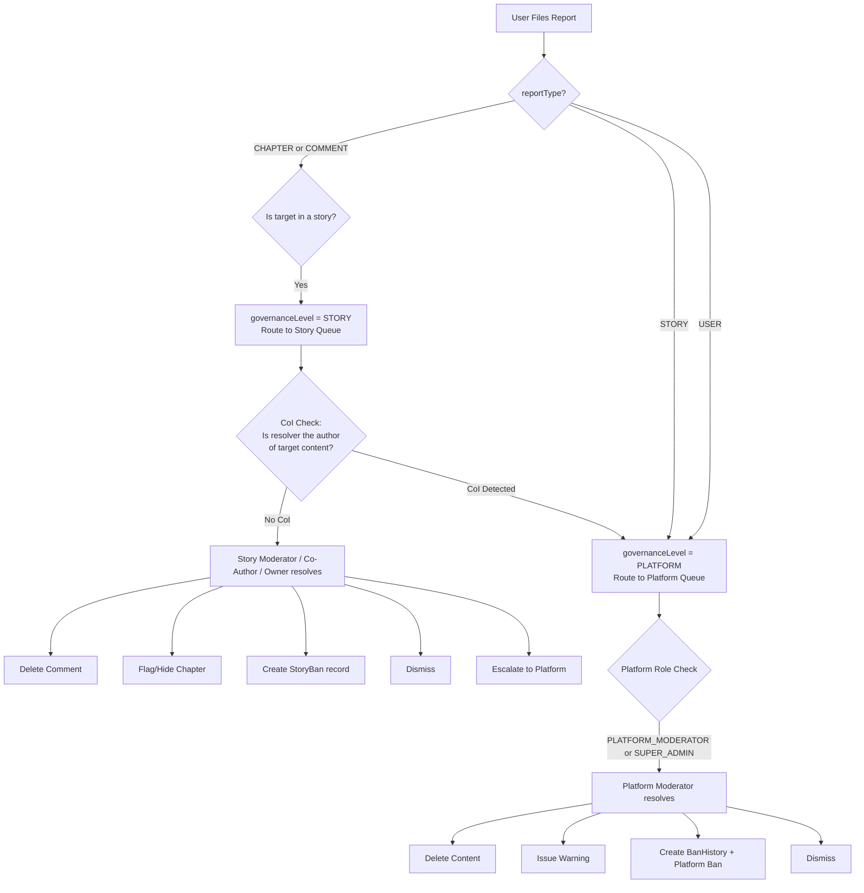
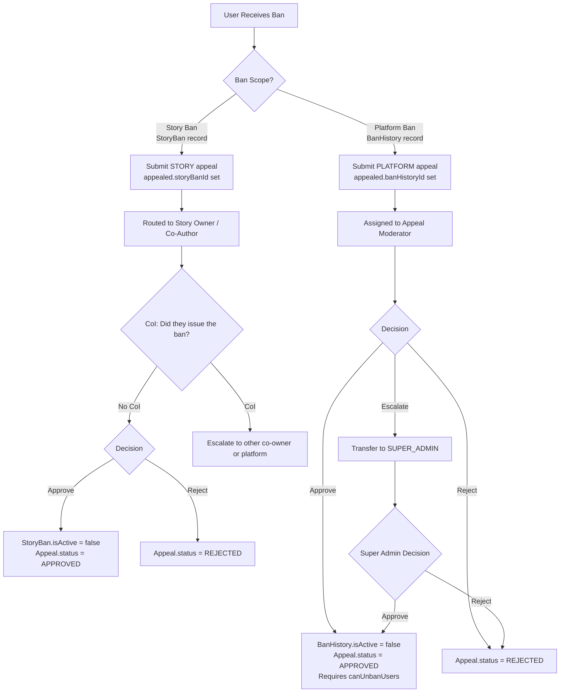

# StoryChain Moderation Architecture — Full Audit & Redesign

> **Scope**: Report model · Appeal model · BanHistory (missing) · StoryBan (missing) · PlatformRole model · StoryCollaborator config · report-enum · RBAC constants · API surface · Moderation policies

---

## Executive Summary

The current moderation architecture has **seven structural categories of problems**:

1. **No `BanHistory` model exists** — the `Appeal` model hard-references a `BanHistory` collection that is completely absent from the codebase.
2. **No `StoryBan` model exists** — story-level bans are described in the document but have no persistence layer.
3. **The `Appeal` model conflates two incompatible scopes** (platform-level ban appeals vs. story-level ban appeals) into one schema with no discriminator.
4. **Conflict of interest in story report resolution** — an owner/co-author can resolve a report filed against their own story with no guard.
5. **Report model is missing critical fields** — no `storySlug` scope anchor, no `actionTaken`, no audit trail.
6. **Enum inconsistencies** — `REPORT_STATUSS` typo, missing `UNDER_REVIEW`, inconsistent casing across platform vs. story roles.
7. **RBAC permission gaps** — no `canResolveReports` permission key, no `canReviewStoryAppeals` key, and the story collaborator config has no `canResolveReports` gate.

---

## 1. Story Reports — Conflict of Interest Analysis

### 1.1 The Problem

The architecture document (§3.3 Review Matrix) states that a story `owner`, `co_author`, or `moderator` can resolve **any** report filed against content in their story. This creates a direct conflict of interest:

**Scenario A — Self-serving dismissal**:
A user reports a chapter written by the story owner for plagiarism. The story owner (the accused party) is permitted to open the report and dismiss it. There is nothing in the model or the permission config that blocks this.

**Scenario B — Biased moderation**:
A user reports a comment left by the story moderator for harassment. The co-author (who is friends with the moderator) can dismiss the report. No audit trail captures who resolved it or why.

**Scenario C — Story-level report routing**:
A report is filed against an entire story (`reportType: 'STORY'`). The document says story-level reviewers handle it, but the owner reviewing a report about *their own story* is the maximum possible conflict.

### 1.2 Missing Fields in `report.model.ts`

| Missing Field | Why It's Needed |
|---|---|
| `storySlug` (scope anchor) | Reports about chapters and comments belong to a story; without this field there is no way to route the report to the correct story moderation queue without additional joins. |
| `governanceLevel` (`'STORY'` \| `'PLATFORM'`) | The system has two queues; without a discriminator, all reports land in one undifferentiated pool. |
| `actionTaken` | The API sends `actionTaken` but the model has no field to persist it. This data is silently dropped. |
| `reviewerRole` | No record of whether the reviewer was a story moderator or a platform moderator. |
| `resolvedBy` | The field is named `reviewedBy` which conflates reviewing (opening/inspecting) with resolving (taking action). |
| `escalatedAt` / `escalatedTo` | Reports can be escalated per the workflow diagram but the model has no fields to track this. |

### 1.3 Proposed Architecture

**Rule: No party may resolve a report in which they are a named target or have a direct stake.**

The guard must be enforced at the service layer with the following check:

```
canResolveReport(resolver, report):
  if report.reportType == 'STORY':
    return resolver is NOT the story owner or co_author of relatedStorySlug
           AND resolver has canModerateComments or canBanFromStory
           AND resolver is a PLATFORM_MODERATOR or SUPER_ADMIN
  if report.reportType == 'CHAPTER':
    targetChapter.authorId !== resolver.userId
    AND resolver has canModerateComments
  if report.reportType == 'COMMENT':
    targetComment.userId !== resolver.userId
    AND resolver has canModerateComments
  if report.reportType == 'USER':
    relatedUserId !== resolver.userId
    AND resolver has canBanUsers (platform level only)
```

**Escalation Rule for STORY reports**: Reports where `reportType === 'STORY'` must bypass the story-level queue entirely and be routed directly to the platform moderation queue. A story owner cannot adjudicate a complaint about their own story.

---

## 2. Story Bans — Missing Model

### 2.1 The Problem

The architecture document (§6.1 B) defines endpoints for story-level bans:
- `POST /api/v1/stories/:storySlug/bans` — ban a user from a story
- `DELETE /api/v1/stories/:storySlug/bans/:userId` — lift a story ban

There is **no Mongoose model** that backs these endpoints. The `StoryCollaborator` model tracks collaborators, not banned users. Searching the entire `src/` directory for `storyBan`, `StoryBan`, or `story_ban` returns zero results.

**Consequence**: Any code calling these endpoints cannot persist the ban. Permission checks elsewhere in the app (e.g., "can this user comment on this story?") have no lookup target. The check would silently pass for banned users.

### 2.2 Proposed `storyBan.model.ts`

```typescript
// src/models/storyBan.model.ts

import mongoose, { Schema } from 'mongoose';

const storyBanSchema = new Schema(
  {
    storySlug: {
      type: String,
      ref: 'Story',
      required: true,
      index: true,
    },
    userId: {
      type: String,
      ref: 'User',
      required: true,
      index: true,
    },
    bannedBy: {
      type: String,
      ref: 'User',
      required: true,
    },
    bannedByRole: {
      type: String,
      enum: ['owner', 'co_author', 'moderator'],
      required: true,
    },
    reason: {
      type: String,
      required: true,
      maxlength: 1000,
    },
    reportId: {
      // The report that triggered this ban (optional)
      type: Schema.Types.ObjectId,
      ref: 'Report',
    },
    isActive: {
      type: Boolean,
      default: true,
      index: true,
    },
    expiresAt: {
      // null = permanent ban
      type: Date,
      default: null,
      index: true,
    },
    liftedAt: Date,
    liftedBy: {
      type: String,
      ref: 'User',
    },
    liftedReason: String,
    appealId: {
      type: Schema.Types.ObjectId,
      ref: 'Appeal',
    },
  },
  { timestamps: true }
);

// One active ban per user per story
storyBanSchema.index({ storySlug: 1, userId: 1, isActive: 1 });
// Efficient lookup: "Is this user banned from this story?"
storyBanSchema.index({ userId: 1, storySlug: 1 }, { unique: false });

export const StoryBan = mongoose.model('StoryBan', storyBanSchema);
```

### 2.3 Efficient Ban-Check Pattern

All routes that permit story participation (commenting, writing a chapter, voting on a PR) must call:

```typescript
// src/features/storyBan/services/storyBan.service.ts
async isUserBannedFromStory(userId: string, storySlug: string): Promise<boolean> {
  const now = new Date();
  const ban = await StoryBan.exists({
    userId,
    storySlug,
    isActive: true,
    $or: [{ expiresAt: null }, { expiresAt: { $gt: now } }],
  });
  return !!ban;
}
```

This query hits the compound `{ storySlug, userId, isActive }` index and returns in O(log n).

---

## 3. Appeal System — Dual-Scope Conflation

### 3.1 The Problem

The current `appeal.modal.ts` has a single schema with:
- `banHistoryId` (required, references `BanHistory`) — designed for **platform-level** ban appeals

But the architecture document also describes **story-level** ban appeals reviewed by owners/co-authors. There is no way to route a story-level appeal through this model because:
1. `banHistoryId` is `required: true`, but story bans don't have `BanHistory` records.
2. There is no `appealType` discriminator — a platform moderator opening the appeal queue would see both types mixed together.
3. There is no `storySlug` to identify which story the story-level appeal belongs to.
4. `userId` is typed as `Schema.Types.ObjectId` but `User` IDs everywhere else are `String` (Clerk IDs). **Type mismatch.**

### 3.2 Missing `banHistory.model.ts`

The appeal model's `required: true` reference to `'BanHistory'` is a **broken foreign key** — the collection does not exist. This means:
- No appeal can ever be created without failing at the DB validation layer.
- The appeal system is **entirely non-functional** as written.

### 3.3 Proposed Architecture

Split the appeal system into two concerns:

**A) Create `banHistory.model.ts`** (the missing model):

```typescript
// src/models/banHistory.model.ts

import mongoose, { Schema } from 'mongoose';

const banHistorySchema = new Schema(
  {
    userId: {
      type: String,  // Clerk ID, consistent with all other models
      ref: 'User',
      required: true,
      index: true,
    },
    bannedBy: {
      type: String,
      ref: 'User',
      required: true,
    },
    reason: {
      type: String,
      required: true,
      maxlength: 2000,
    },
    reportId: {
      type: Schema.Types.ObjectId,
      ref: 'Report',
    },
    banType: {
      type: String,
      enum: ['TEMPORARY', 'PERMANENT'],
      required: true,
    },
    durationDays: Number, // null if PERMANENT
    expiresAt: {
      type: Date,
      index: true,
    },
    isActive: {
      type: Boolean,
      default: true,
      index: true,
    },
    liftedAt: Date,
    liftedBy: {
      type: String,
      ref: 'User',
    },
    liftedReason: String,
    evidenceUrls: [String],
    internalNotes: String,
  },
  { timestamps: true }
);

banHistorySchema.index({ userId: 1, isActive: 1 });
banHistorySchema.index({ isActive: 1, expiresAt: 1 }); // For expiry jobs

export const BanHistory = mongoose.model('BanHistory', banHistorySchema);
```

**B) Redesign `appeal.model.ts` with a discriminator**:

```typescript
// src/models/appeal.model.ts  (rename from appeal.modal.ts — typo in filename)

import mongoose, { Schema } from 'mongoose';

const appealSchema = new Schema(
  {
    // ── Discriminator ──────────────────────────────────────────────
    appealScope: {
      type: String,
      enum: ['PLATFORM', 'STORY'],
      required: true,
      index: true,
    },

    // ── Appellant ──────────────────────────────────────────────────
    userId: {
      type: String,   // Clerk ID — FIXED from ObjectId
      ref: 'User',
      required: true,
      index: true,
    },

    // ── Target (platform scope) ────────────────────────────────────
    banHistoryId: {
      type: Schema.Types.ObjectId,
      ref: 'BanHistory',
      // Required only when appealScope === 'PLATFORM'
      index: true,
    },

    // ── Target (story scope) ──────────────────────────────────────
    storyBanId: {
      type: Schema.Types.ObjectId,
      ref: 'StoryBan',
      // Required only when appealScope === 'STORY'
      index: true,
    },
    storySlug: {
      type: String,
      ref: 'Story',
      // Required only when appealScope === 'STORY'
      index: true,
    },

    // ── Appeal Content ─────────────────────────────────────────────
    appealReason: {
      type: String,
      required: true,
      maxlength: 200,
    },
    explanation: {
      type: String,
      required: true,
      minlength: 50,
      maxlength: 2000,
    },
    evidenceUrls: [String],

    // ── Status ────────────────────────────────────────────────────
    status: {
      type: String,
      enum: ['PENDING', 'UNDER_REVIEW', 'APPROVED', 'REJECTED', 'ESCALATED', 'WITHDRAWN'],
      default: 'PENDING',
      index: true,
    },
    priority: {
      type: String,
      enum: ['LOW', 'NORMAL', 'HIGH', 'URGENT'],
      default: 'NORMAL',
      index: true,
    },

    // ── Assignment (platform only) ────────────────────────────────
    assignedTo: {
      type: String,
      ref: 'User',
      index: true,
    },
    assignedAt: Date,

    // ── Review ────────────────────────────────────────────────────
    reviewedBy: {
      type: String,   // FIXED from ObjectId
      ref: 'User',
    },
    reviewedAt: Date,
    reviewDecision: {
      type: String,
      enum: ['APPROVE', 'REJECT', 'ESCALATE'],
    },
    reviewNotes: String,
    internalNotes: String,

    // ── Escalation ────────────────────────────────────────────────
    escalatedTo: {
      type: String,   // FIXED from ObjectId
      ref: 'User',
    },
    escalatedAt: Date,
    escalationReason: String,

    // ── Response to Appellant ─────────────────────────────────────
    responseMessage: String,

    // ── Metrics ───────────────────────────────────────────────────
    responseTimeMs: Number,   // Renamed from responseTime for clarity
    reviewCount: {
      type: Number,
      default: 0,
    },

    // ── Duplicate Guard ──────────────────────────────────────────
    // Prevent a user from submitting multiple open appeals for same ban
    isDuplicate: {
      type: Boolean,
      default: false,
    },
  },
  { timestamps: true }
);

// Compound indexes
appealSchema.index({ status: 1, priority: -1, createdAt: 1 });
appealSchema.index({ assignedTo: 1, status: 1 });
appealSchema.index({ appealScope: 1, status: 1 });
appealSchema.index({ userId: 1, banHistoryId: 1, status: 1 });   // duplicate check
appealSchema.index({ userId: 1, storyBanId: 1, status: 1 });     // duplicate check

// Validation: exactly one of banHistoryId or storyBanId must be set
appealSchema.pre('validate', function (next) {
  const hasPlatform = !!this.banHistoryId;
  const hasStory = !!this.storyBanId;
  if (this.appealScope === 'PLATFORM' && !hasPlatform) {
    return next(new Error('banHistoryId is required for PLATFORM appeals'));
  }
  if (this.appealScope === 'STORY' && !hasStory) {
    return next(new Error('storyBanId and storySlug are required for STORY appeals'));
  }
  next();
});

export const Appeal = mongoose.model('Appeal', appealSchema);
```

### 3.4 Duplicate Appeal Prevention

A user must not be able to submit multiple open appeals for the same ban. Add this service-layer guard:

```typescript
async createAppeal(dto: CreateAppealDto): Promise<IAppeal> {
  const existingOpen = await Appeal.findOne({
    userId: dto.userId,
    [dto.appealScope === 'PLATFORM' ? 'banHistoryId' : 'storyBanId']:
      dto.appealScope === 'PLATFORM' ? dto.banHistoryId : dto.storyBanId,
    status: { $in: ['PENDING', 'UNDER_REVIEW', 'ESCALATED'] },
  });
  if (existingOpen) {
    throw new ConflictError('An open appeal already exists for this ban.');
  }
  // ... create appeal
}
```

---

## 4. Models — Complete Issues Register

### 4.1 `report.model.ts`

| Issue | Severity | Fix |
|---|---|---|
| No `governanceLevel` field | 🔴 Critical | Add `enum: ['STORY', 'PLATFORM']` |
| No `storySlug` scope anchor | 🔴 Critical | Add `storySlug: { type: String, ref: 'Story' }` |
| No `actionTaken` field | 🔴 Critical | Add `enum: ['DELETE_COMMENT', 'FLAG_CHAPTER', 'BAN_FROM_STORY', 'DELETE_CONTENT', 'GLOBAL_BAN', 'OFFICIAL_WARNING', 'NONE']` |
| No `escalatedTo` / `escalatedAt` | 🟡 High | Add both fields |
| No `storyBanId` link | 🟡 High | Add `storyBanId` ref to track what ban resulted from this report |
| `reviewedBy` conflates reviewer with resolver | 🟡 High | Rename to `resolvedBy` and add separate `openedBy` |
| Typo in export: `REPORT_STATUSS` | 🟠 Medium | Rename to `REPORT_STATUSES` |
| Missing `UNDER_REVIEW` status | 🟡 High | Add to enum (document mentions it but enum doesn't have it) |
| No `reporterNote` min-length | 🟠 Medium | Add `minlength: 10` |
| No unique guard per reporter per target | 🟠 Medium | Add compound index `{ reporterId, relatedChapterSlug }` etc. to prevent spam-reporting |

### 4.2 `appeal.modal.ts` (also: filename typo — should be `appeal.model.ts`)

| Issue | Severity | Fix |
|---|---|---|
| Filename typo `.modal.ts` vs `.model.ts` | 🟠 Medium | Rename file |
| `banHistoryId` required but `BanHistory` model missing | 🔴 Critical | Create `banHistory.model.ts` |
| No `appealScope` discriminator | 🔴 Critical | Add `enum: ['PLATFORM', 'STORY']` |
| No `storyBanId` or `storySlug` for story-scope appeals | 🔴 Critical | Add both fields |
| `userId` typed as `ObjectId` instead of `String` | 🔴 Critical | Change to `type: String` (Clerk ID) |
| `reviewedBy` typed as `ObjectId` | 🔴 Critical | Change to `type: String` (Clerk ID) |
| `escalatedTo` typed as `ObjectId` | 🔴 Critical | Change to `type: String` (Clerk ID) |
| `assignedTo` typed as `ObjectId` | 🔴 Critical | Change to `type: String` (Clerk ID) |
| No `WITHDRAWN` status | 🟡 High | Add — users should be able to withdraw an appeal |
| `responseTime: Number` — unit unclear | 🟠 Medium | Rename to `responseTimeMs` |
| No duplicate appeal prevention index | 🟡 High | Add compound index on `userId + banHistoryId + status` |

### 4.3 `platformRole.model.ts`

| Issue | Severity | Fix |
|---|---|---|
| No `permissions` sub-document in model | 🟡 High | The `PLATFORM_ROLES` constant defines permissions correctly, but the model doesn't store them. This is fine if permissions are always derived from constants — but the pattern is inconsistent. Document the intent explicitly. |
| No `revokedAt` / `revokedBy` | 🟠 Medium | Role assignment has no audit trail for revocation |
| `assignedBy` is `String` but should be `ref: 'User'` | 🟠 Medium | Add `ref: 'User'` |

### 4.4 `storyCollaborator.model.ts`

| Issue | Severity | Fix |
|---|---|---|
| No `canResolveReports` in permission config | 🔴 Critical | See §5 RBAC section |
| No `canReviewStoryAppeals` in permission config | 🔴 Critical | See §5 RBAC section |
| `slug` field references `'Story'` but is named `slug` not `storySlug` | 🟠 Medium | Rename to `storySlug` for consistency with all other models |
| `invitedAt` defaults to `Date.now` but `acceptedAt` has no constraint | 🟠 Medium | Add: `acceptedAt` must be >= `invitedAt` |
| No `removedAt` / `removedBy` audit fields | 🟠 Medium | Track who removed a collaborator and when |

---

## 5. RBAC & Permissions — Full Audit

### 5.1 Missing Permission Keys in Story Collaborator Config

The `STORY_COLLABORATOR_ROLE_CONFIG` is missing two critical moderation permissions:

```typescript
// Missing from every role's permissions block:
canResolveReports: boolean;   // Can this role mark a report as resolved/dismissed?
canReviewStoryAppeals: boolean;  // Can this role approve/reject a story-level appeal?
```

**Proposed additions**:

| Role | `canResolveReports` | `canReviewStoryAppeals` | Constraint |
|---|---|---|---|
| `owner` | `true` | `true` | **Cannot resolve reports where they are the reported party** |
| `co_author` | `true` | `true` | **Cannot resolve reports where they are the reported party** |
| `moderator` | `true` | `false` | Cannot overturn owner/co-author decisions |
| `reviewer` | `false` | `false` | — |
| `contributor` | `false` | `false` | — |

### 5.2 Missing Permission Keys in Platform Role Config

The `PLATFORM_ROLES` constant is missing:

```typescript
canResolveReports: boolean;   // Separate from canViewAllReports
canIssueWarning: boolean;     // Issuing a formal warning is distinct from a ban
canExpireActiveBans: boolean; // Can manually expire a temporary ban early
```

**Proposed additions**:

| Role | `canResolveReports` | `canIssueWarning` | `canExpireActiveBans` |
|---|---|---|---|
| `SUPER_ADMIN` | `true` | `true` | `true` |
| `PLATFORM_MODERATOR` | `true` | `true` | `false` |
| `APPEAL_MODERATOR` | `false` | `false` | `true` |
| `USER` | `false` | `false` | `false` |

### 5.3 Enum Inconsistency: Platform vs. Story Role Casing

Platform roles use `SCREAMING_SNAKE_CASE` (`SUPER_ADMIN`, `PLATFORM_MODERATOR`) while story collaborator roles use `snake_case` (`owner`, `co_author`). This is intentional per domain separation, but it must be **explicitly documented** and enforced — the `CollaboratorRole` enum in `constants/index.ts` (line 504) uses `SCREAMING_SNAKE_CASE` for collaborator roles (`OWNER`, `MODERATOR`), directly contradicting the actual values in `storyCollaborator-enum.ts` which uses lowercase. **These two definitions conflict.**

**Fix**: Delete the `CollaboratorRole` enum from `constants/index.ts` (line 504–509). It is a duplicate of `StoryCollaboratorRole` from the feature directory with the wrong casing. Import `StoryCollaboratorRole` directly where needed.

### 5.4 `APPEAL_MODERATOR` Can View All Reports — Unnecessary Privilege

The `APPEAL_MODERATOR` has `canViewAllReports: true`. An appeal moderator's job is to adjudicate **appeals**, not to triage **reports**. Giving them full report visibility is scope creep.

**Fix**: Set `canViewAllReports: false` for `APPEAL_MODERATOR`. They only need to see the report linked to the appeal they are reviewing (accessible via the appeal's `reportId`).

### 5.5 Story Moderator Can Ban But Not Resolve Reports

`canBanFromStory: true` is set for story `moderator`, but there is no `canResolveReports` in the config. The architecture says story moderators can "Dismiss Report" but the permission key does not exist. Every call to resolve a report would need custom ad-hoc checks instead of a clean permission lookup.

---

## 6. Policies & Rules — Complete Moderation Policy Table

### 6.1 Who Can Perform Each Action

| Action | Story Owner | Story Co-Author | Story Moderator | Platform Moderator | Appeal Moderator | Super Admin | Rule |
|---|---|---|---|---|---|---|---|
| **File a report** | ✅ | ✅ | ✅ | ✅ | ✅ | ✅ | Any authenticated user |
| **View story report queue** | ✅ | ✅ | ✅ | ✅ | ❌ | ✅ | Story roles via collaborator check; Platform roles via `canViewAllReports` |
| **Resolve CHAPTER report** | ✅\* | ✅\* | ✅ | ✅ | ❌ | ✅ | \*Cannot resolve if they authored the chapter |
| **Resolve COMMENT report** | ✅\* | ✅\* | ✅ | ✅ | ❌ | ✅ | \*Cannot resolve if they wrote the comment |
| **Resolve STORY report** | ❌ | ❌ | ❌ | ✅ | ❌ | ✅ | **Always platform-level** — owner/co-author have CoI |
| **Resolve USER report** | ❌ | ❌ | ❌ | ✅ | ❌ | ✅ | Always platform-level |
| **Dismiss any report** | ✅\* | ✅\* | ✅ | ✅ | ❌ | ✅ | \*Subject to CoI rules |
| **Escalate story report to platform** | ✅ | ✅ | ✅ | — | — | — | Any story moderator can escalate |
| **Issue story ban** | ✅ | ✅ | ✅ | ✅ | ❌ | ✅ | Story scope for story roles; must not self-ban |
| **Lift story ban** | ✅ | ✅ | ❌ | ✅ | ❌ | ✅ | Moderator cannot lift bans they did not issue without owner approval |
| **Issue platform ban** | ❌ | ❌ | ❌ | ✅ | ❌ | ✅ | `canBanUsers` required |
| **Lift platform ban** | ❌ | ❌ | ❌ | ❌ | ✅ | ✅ | Separation of powers — banning and unbanning are separate roles |
| **View story appeal queue** | ✅ | ✅ | ❌ | ❌ | ❌ | ✅ | — |
| **Decide story appeal** | ✅ | ✅ | ❌ | ❌ | ❌ | ✅ | Cannot decide their own story appeal if they issued the ban |
| **View platform appeal queue** | ❌ | ❌ | ❌ | ✅ | ✅ | ✅ | — |
| **Decide platform appeal (approve)** | ❌ | ❌ | ❌ | ❌ | ✅ | ✅ | `canApproveAppeals` + `canUnbanUsers` |
| **Decide platform appeal (reject)** | ❌ | ❌ | ❌ | ✅ | ✅ | ✅ | `canRejectAppeals` |
| **Escalate platform appeal** | ❌ | ❌ | ❌ | ✅ | ✅ | — | `canEscalateAppeals` |
| **Issue official warning** | ❌ | ❌ | ❌ | ✅ | ❌ | ✅ | `canIssueWarning` |
| **Delete any content globally** | ❌ | ❌ | ❌ | ✅ | ❌ | ✅ | `canDeleteAnyContent` |
| **Withdraw own appeal** | ✅ | ✅ | ✅ | ✅ | ✅ | ✅ | Any appellant can withdraw while status is PENDING |

### 6.2 Conflict of Interest (CoI) Rules — Hard Constraints

These must be enforced at the **service layer**, not just documented:

1. **You cannot resolve a report against content you created.**
2. **You cannot resolve a report against an entire story you own or co-author.**
3. **You cannot approve/reject an appeal for a ban you personally issued.**
4. **You cannot ban yourself from a story you own.**
5. **A `PLATFORM_MODERATOR` who issued a ban cannot also decide the appeal against that ban.** (The `Appeal.reviewedBy` must differ from `BanHistory.bannedBy`.)

---

## 7. Enums — Complete Review

### 7.1 `ReportStatus` — Missing `UNDER_REVIEW`

The appeal model has `UNDER_REVIEW` as a status. The workflow diagram shows a two-step process: `PENDING → REVIEWED → RESOLVED/DISMISSED`. But "REVIEWED" is ambiguous — it means "someone opened it" not "it was acted upon." The lifecycle should be:

```typescript
// BEFORE (broken — missing state, ambiguous name)
export enum ReportStatus {
  PENDING = 'PENDING',
  REVIEWED = 'REVIEWED',   // ambiguous: viewed? or reviewed with action?
  RESOLVED = 'RESOLVED',
  DISMISSED = 'DISMISSED',
}

// AFTER (clear, complete)
export enum ReportStatus {
  PENDING = 'PENDING',         // Submitted, not yet opened
  UNDER_REVIEW = 'UNDER_REVIEW', // Moderator has opened and is reviewing
  RESOLVED = 'RESOLVED',       // Action was taken (ban, delete, warning)
  DISMISSED = 'DISMISSED',     // Found invalid or no violation
  ESCALATED = 'ESCALATED',     // Passed to platform from story level
}
```

### 7.2 `REPORT_STATUSS` Typo

The export constant is named `REPORT_STATUSS` (double S). This is a typo that will cause confusing compiler errors and hard-to-find bugs.

```typescript
// BEFORE
export const REPORT_STATUSS = [...] as const;

// AFTER
export const REPORT_STATUSES = [...] as const;
```

Update all usages in `report.model.ts` and anywhere `REPORT_STATUSS` is imported.

### 7.3 Missing `ReportReason` Values

| Missing Value | Justification |
|---|---|
| `MISINFORMATION` | Common reason for STORY-type reports |
| `VIOLENCE` | Distinct from `INAPPROPRIATE_CONTENT` — needed for content rating enforcement |
| `UNDERAGE_CONTENT` | Required for legal compliance; should be immediately escalated |
| `IMPERSONATION` | Distinct USER report type |

### 7.4 `ReportReason` Duplication in `constants/index.ts`

`ReportReason` is defined **twice**: once in `report-enum.ts` and again in `constants/index.ts` (line 511). They are identical. The one in `constants/index.ts` should be removed and replaced with a re-export from the feature directory.

### 7.5 Appeal `reviewDecision` vs. Appeal `status` Redundancy

The appeal model has both:
- `status: 'PENDING' | 'UNDER_REVIEW' | 'APPROVED' | 'REJECTED' | 'ESCALATED'`
- `reviewDecision: 'APPROVE' | 'REJECT' | 'ESCALATE'`

The `reviewDecision` captures the moderator's submitted intent while `status` reflects the actual current state. This is intentional and correct — but `reviewDecision` values should match `status` values for consistency:

```typescript
// BEFORE (inconsistent verb tense — action vs. state)
reviewDecision: 'APPROVE' | 'REJECT' | 'ESCALATE'
status:         'APPROVED' | 'REJECTED' | 'ESCALATED'

// AFTER (normalize reviewDecision to match status terminal states)
reviewDecision: 'APPROVED' | 'REJECTED' | 'ESCALATED'
```

### 7.6 `CollaboratorRole` Enum in `constants/index.ts` — Wrong Casing, Should Be Deleted

As noted in §5.3, this enum uses `OWNER`, `MODERATOR`, `REVIEWER`, `CONTRIBUTOR` (no `CO_AUTHOR`) with screaming snake case — which conflicts with the actual database values `owner`, `co_author`, `moderator`, `reviewer`, `contributor`. Delete it.

---

## 8. Rewritten Architecture — Report Flow



---

## 9. Rewritten Architecture — Appeal Flow



---

## 10. API Endpoints — Corrections

### Endpoints to Add

| Method | Endpoint | Guard | Description |
|---|---|---|---|
| `POST` | `/api/v1/stories/:storySlug/appeals` | Banned user | Submit a story-level ban appeal (**missing from document**) |
| `GET` | `/api/v1/admin/ban-history` | `canBanUsers` | List all platform bans |
| `GET` | `/api/v1/admin/ban-history/:banId` | `canBanUsers` | Get specific ban record |
| `GET` | `/api/v1/stories/:storySlug/bans` | Story `owner`, `co_author`, `moderator` | List all story bans — **missing** |
| `GET` | `/api/v1/stories/:storySlug/bans/check/:userId` | Story collaborator | Check if user is banned — **missing** |

### Endpoints to Fix

| Current | Problem | Fix |
|---|---|---|
| `PATCH /api/v1/stories/:storySlug/reports/:reportId/resolve` | Allows owner to resolve reports against their own story | Add CoI guard middleware |
| `POST /api/v1/appeals` | Only supports platform-level (requires `banHistoryId`) | Add `appealScope` to payload; route to correct handler |
| `PATCH /api/v1/admin/reports/:reportId/status` | Guard is `canViewAllReports` — viewing and changing status are different | Change guard to `canResolveReports` |

---

## 11. Summary of Required Changes

### New Files to Create
1. `src/models/banHistory.model.ts` — platform ban persistence
2. `src/models/storyBan.model.ts` — story ban persistence
3. `src/features/banHistory/` — feature module
4. `src/features/storyBan/` — feature module with `isUserBannedFromStory()` service

### Files to Modify
1. `src/models/report.model.ts` — add 6 missing fields
2. `src/models/appeal.modal.ts` → rename to `appeal.model.ts` + major schema changes
3. `src/features/report/types/report-enum.ts` — fix typo, add `UNDER_REVIEW`, add reasons
4. `src/features/storyCollaborator/types/storyCollaborator-enum.ts` — add `canResolveReports`, `canReviewStoryAppeals`
5. `src/constants/index.ts` — delete duplicate `CollaboratorRole` enum, add missing permission keys, add `canResolveReports`, `canIssueWarning`, `canExpireActiveBans`

### Architecture Document to Rewrite
- `docs/architecture/REPORT_AND_APPEAL_FLOW.md` — reflect all of the above

---

*Audit completed: 2026-07-31*
