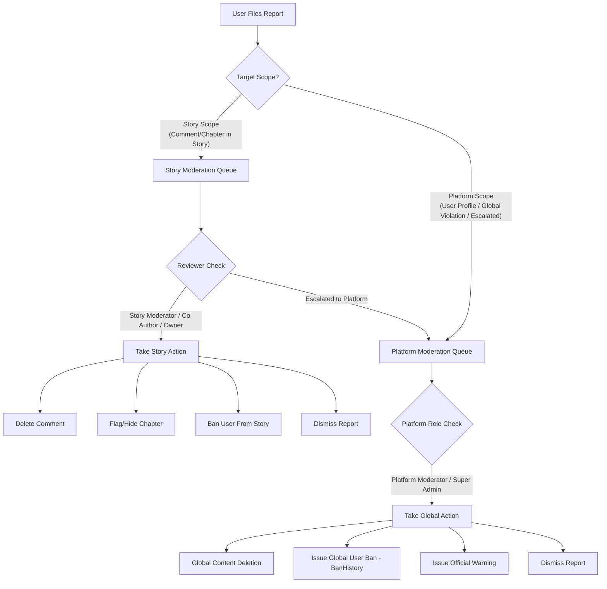
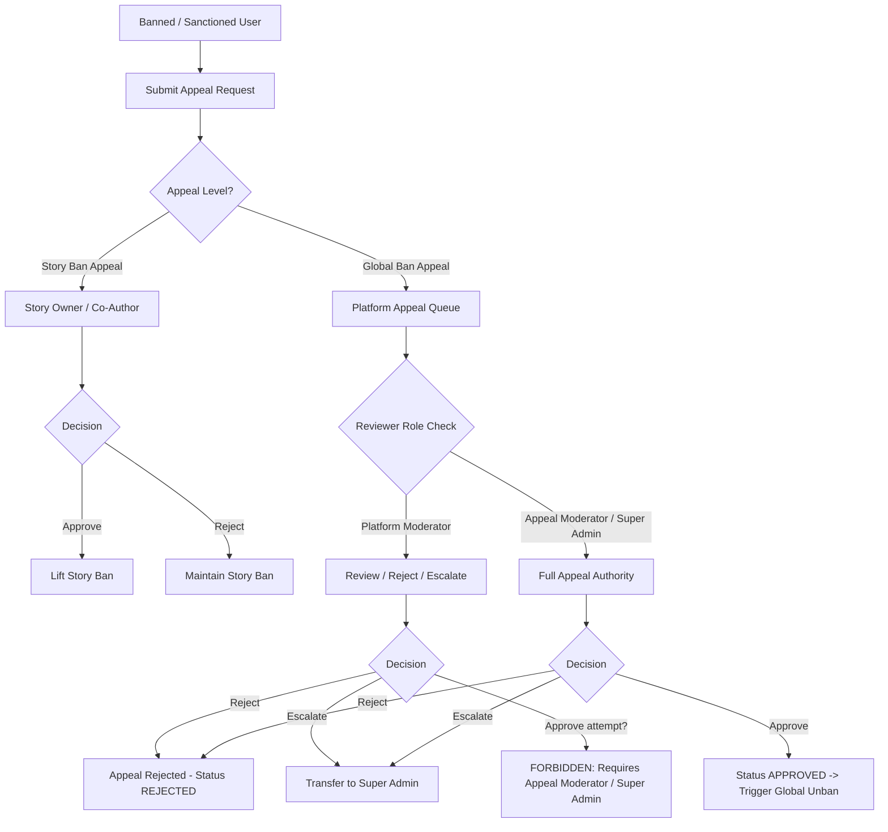
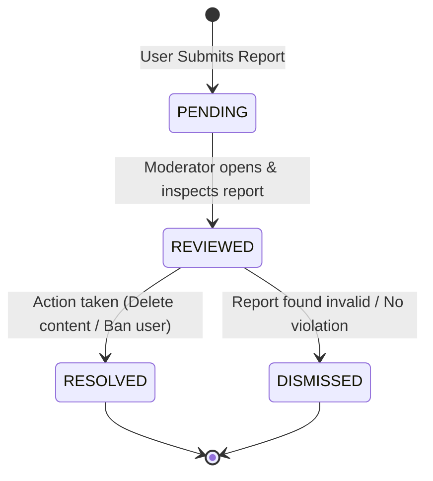
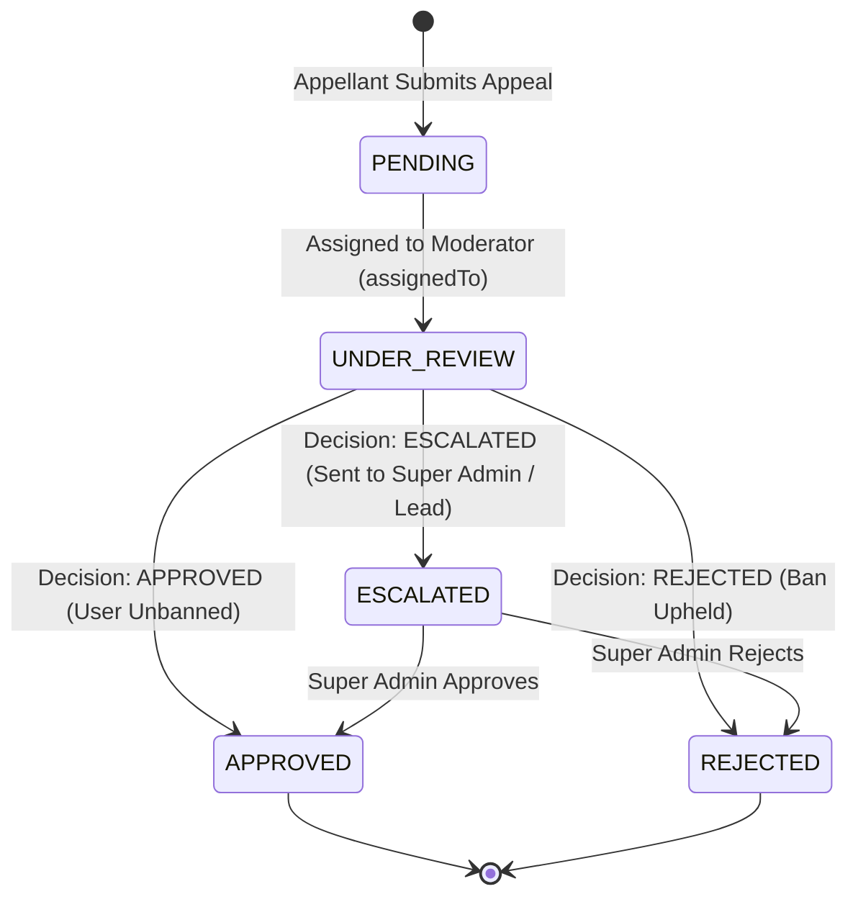

# Story & Platform Moderation: Report & Appeal Flow Architecture

This document provides a comprehensive architectural specification for the **Report** and **Appeal** flows within StoryChain Backend. It details the governance model, role-based access control (RBAC), permission matrices, decision workflows, and full list of required API endpoints across both **Story Level** (decentralized story governance) and **Platform Level** (global system administration).

---

## 1. Overview & Dual-Tier Moderation Model

StoryChain operates on a **dual-tier governance architecture**:

1. **Story Level (Decentralized Governance)**:
   - Moderation actions are localized to a specific story (identified by `storySlug`).
   - Managed by story creators and assigned story collaborators.
   - Handles story-specific comments, chapter flags, and story-level user bans.

2. **Platform Level (Global System Governance)**:
   - Moderation actions apply platform-wide across all stories and users.
   - Managed by platform administrators and specialized moderators.
   - Handles global content deletions, platform user bans (`BanHistory`), system-wide reports, and formal ban appeals.

### Core Distinction: Report vs. Appeal

| Domain     | Action Purpose                                                     | Initiator                        | Target Entity                                         | Reviewer                                                                                |
| :--------- | :----------------------------------------------------------------- | :------------------------------- | :---------------------------------------------------- | :-------------------------------------------------------------------------------------- |
| **Report** | Flag harmful, abusive, inappropriate, or illegal content/behavior. | Any authenticated user (`USER`). | `CHAPTER`, `COMMENT`, `USER`, `STORY`.                | Story Moderators (Story Level) / Platform Moderators (Platform Level).                  |
| **Appeal** | Challenge a sanction, content deletion, or user ban.               | Punished or affected user.       | Active ban record (`banHistoryId`) or story sanction. | Story Owner/Co-Author (Story Level) / Appeal Moderators & Super Admin (Platform Level). |

---

## 2. Roles & Permissions Hierarchy

### 2.1 Platform Roles (`PlatformRole`)

Defined in [`platformRole.model.ts`](file:///Users/mac/Desktop/dhruv/story_chain_be/src/models/platformRole.model.ts) and configured in [`constants/index.ts`](file:///Users/mac/Desktop/dhruv/story_chain_be/src/constants/index.ts):

| Platform Role            | Key Responsibilities                                                            | Report Privileges                                                                                                                              | Appeal Privileges                                                                                                                                                                        |
| :----------------------- | :------------------------------------------------------------------------------ | :--------------------------------------------------------------------------------------------------------------------------------------------- | :--------------------------------------------------------------------------------------------------------------------------------------------------------------------------------------- |
| **`SUPER_ADMIN`**        | Master platform control. Full administrative, financial, and governance access. | Can view all reports (`canViewAllReports`), resolve/dismiss any report, delete any content (`canDeleteAnyContent`), ban users (`canBanUsers`). | Full decision authority (`canReviewAppeals`, `canApproveAppeals`, `canRejectAppeals`, `canEscalateAppeals`, `canUnbanUsers`).                                                            |
| **`PLATFORM_MODERATOR`** | Frontline content enforcement and community moderation across all stories.      | View all reports (`canViewAllReports`), delete any content (`canDeleteAnyContent`), ban offending users globally (`canBanUsers`).              | Can review, reject, and escalate appeals (`canReviewAppeals`, `canRejectAppeals`, `canEscalateAppeals`). **Cannot approve unbans** (`canUnbanUsers: false`).                             |
| **`APPEAL_MODERATOR`**   | Judicial role dedicated exclusively to evaluating and deciding on ban appeals.  | View all reports (`canViewAllReports`).                                                                                                        | Full appeal resolution authority (`canReviewAppeals`, `canApproveAppeals`, `canRejectAppeals`, `canEscalateAppeals`, `canUnbanUsers`). **Cannot issue new bans** (`canBanUsers: false`). |
| **`USER`**               | Standard platform reader, author, or community participant.                     | Create reports for any chapter, comment, user, or story.                                                                                       | Submit appeals for active bans or sanctions.                                                                                                                                             |

> [!IMPORTANT]
> **Separation of Powers**: To prevent moderation abuse, `PLATFORM_MODERATOR` has ban power but **cannot approve unban appeals**. Conversely, `APPEAL_MODERATOR` can approve unban appeals but **cannot issue initial user bans**. `SUPER_ADMIN` retains total authority.

---

### 2.2 Story Collaborator Roles (`StoryCollaboratorRole`)

Defined in [`storyCollaborator.model.ts`](file:///Users/mac/Desktop/dhruv/story_chain_be/src/models/storyCollaborator.model.ts) and [`storyCollaborator-enum.ts`](file:///Users/mac/Desktop/dhruv/story_chain_be/src/features/storyCollaborator/types/storyCollaborator-enum.ts):

| Story Role        | Scope & Description                                                                 | Story Report Capabilities                                                                                                                      | Story Appeal Capabilities                                                              |
| :---------------- | :---------------------------------------------------------------------------------- | :--------------------------------------------------------------------------------------------------------------------------------------------- | :------------------------------------------------------------------------------------- |
| **`owner`**       | Creator of the story. Ultimate control over story settings and collaborators.       | Moderate & delete story comments (`canModerateComments`, `canDeleteComments`), flag/delete chapters, ban users from story (`canBanFromStory`). | Can review and reverse any story-level bans or moderator sanctions within their story. |
| **`co_author`**   | Equal creation partner. Can edit story settings and manage content.                 | Moderate & delete story comments, edit/delete chapters, ban users from story (`canBanFromStory`).                                              | Can review and reverse story-level bans or moderator sanctions within their story.     |
| **`moderator`**   | Community manager assigned specifically to moderate PRs and comments for the story. | Moderate & delete story comments (`canModerateComments`, `canDeleteComments`), approve/reject PRs, ban users from story (`canBanFromStory`).   | Cannot overturn owner/co-author decisions. Handles initial story dispute inquiries.    |
| **`reviewer`**    | Code/chapter quality reviewer for Pull Requests.                                    | Can report inappropriate PRs/comments as a standard user.                                                                                      | No moderation or appeal review authority.                                              |
| **`contributor`** | Trusted writer allowed to append chapters directly.                                 | Can report content as a standard user.                                                                                                         | No moderation or appeal review authority.                                              |

---

## 3. The Report Workflow

### 3.1 Who Can File a Report?

- **Platform Level**: Any registered `USER` can submit a report.
- **Story Level**: Any registered `USER` interacting with a specific story, chapter, or comment can file a report.

### 3.2 Report Categories & Target Entities

Supported target types in [`report.model.ts`](file:///Users/mac/Desktop/dhruv/story_chain_be/src/models/report.model.ts):

- `CHAPTER`: Flagging inappropriate content, plagiarized text, or policy violations in a chapter.
- `COMMENT`: Flagging offensive, spam, or harassing comments under a chapter/story.
- `USER`: Reporting abusive user profiles, harassment, or spam bots.
- `STORY`: Reporting an entire story for copyright infringement or violation of guidelines.

Supported Reasons:

- `SPAM`, `HARASSMENT`, `INAPPROPRIATE_CONTENT`, `COPYRIGHT`, `OFF_TOPIC`, `OTHER`.

---

### 3.3 Who Can Review & Resolve Reports?

#### Detailed Review Matrix for Reports:

| Governance Level   | Reviewer Role                                           | Execution Permission Check                                                          | Allowed Actions                                                                                                                                         |
| :----------------- | :------------------------------------------------------ | :---------------------------------------------------------------------------------- | :------------------------------------------------------------------------------------------------------------------------------------------------------ |
| **Story Level**    | Story `owner` Story `co_author` Story `moderator` | `canModerateComments: true` `canDeleteComments: true` `canBanFromStory: true` | - Delete abusive comment on story - Flag or hide chapter in story - Ban user from commenting/writing in this story - Dismiss invalid report    |
| **Platform Level** | `PLATFORM_MODERATOR` `SUPER_ADMIN`                   | `canViewAllReports: true` `canDeleteAnyContent: true` `canBanUsers: true`     | - Delete content across any story globally - Issue platform-wide ban (`BanHistory`) - Dismiss platform report - Escalate report to Super Admin |

---

## 4. The Appeal Workflow

### 4.1 Who Can File an Appeal?

- Any user who has received a moderation sanction:
  - **Platform Level**: Users banned globally (associated with `banHistoryId`) or whose content was removed by a platform moderator.
  - **Story Level**: Users banned from participating in a specific story by a story moderator.

---

### 4.2 Who Can Review & Decide on Appeals?

#### Detailed Decision Matrix for Appeals:

| Governance Level   | Reviewer Role                      | Allowed Review Decisions                                                                      | Permissions Required                                                                                                                     |
| :----------------- | :--------------------------------- | :-------------------------------------------------------------------------------------------- | :--------------------------------------------------------------------------------------------------------------------------------------- |
| **Story Level**    | Story `owner` Story `co_author` | `APPROVE` (Unban from story) `REJECT` (Maintain story ban)                                 | Story ownership / co-authorship.                                                                                                         |
| **Platform Level** | `PLATFORM_MODERATOR`               | `REJECT` (Uphold ban) `ESCALATE` (Pass to Super Admin)                                     | `canReviewAppeals: true` `canRejectAppeals: true` `canEscalateAppeals: true` _(Cannot unban/approve)_                           |
| **Platform Level** | `APPEAL_MODERATOR`                 | `APPROVE` (Execute global unban) `REJECT` (Uphold ban) `ESCALATE` (Pass to Super Admin) | `canReviewAppeals: true` `canApproveAppeals: true` `canRejectAppeals: true` `canEscalateAppeals: true` `canUnbanUsers: true` |
| **Platform Level** | `SUPER_ADMIN`                      | `APPROVE` `REJECT` `ESCALATE`                                                           | Master authority over all decisions and overrides.                                                                                       |

---

## 5. Entity State Lifecycle Diagrams

### 5.1 Report Status Lifecycle

### 5.2 Appeal Status Lifecycle

---

## 6. Required API Endpoints Specification

### 6.1 Report API Endpoints

#### A. User Endpoints (Filing & Viewing Own Reports)

| Method | Endpoint                     | Auth Required | Payload / Query Params                                                                                                                                                                               | Description                                                                |
| :----- | :--------------------------- | :------------ | :--------------------------------------------------------------------------------------------------------------------------------------------------------------------------------------------------- | :------------------------------------------------------------------------- |
| `POST` | `/api/v1/reports`            | Yes (`USER`)  | `{ reportType: 'CHAPTER' \| 'COMMENT' \| 'USER' \| 'STORY', relatedChapterSlug?, relatedCommentId?, relatedUserId?, relatedStorySlug?, reason: 'SPAM' \| 'HARASSMENT' \| ..., description: string }` | Create/submit a new content or user report.                                |
| `GET`  | `/api/v1/reports/my-reports` | Yes (`USER`)  | Query: `page`, `limit`, `status`                                                                                                                                                                     | Retrieve a paginated list of reports submitted by the logged-in user.      |
| `GET`  | `/api/v1/reports/:reportId`  | Yes (`USER`)  | Path: `reportId`                                                                                                                                                                                     | Get detailed status and resolution of a specific report filed by the user. |

#### B. Story-Level Moderation Endpoints

| Method   | Endpoint                                               | Required Role / Guard                   | Payload / Query Params                                                                                                                      | Description                                                                           |
| :------- | :----------------------------------------------------- | :-------------------------------------- | :------------------------------------------------------------------------------------------------------------------------------------------ | :------------------------------------------------------------------------------------ |
| `GET`    | `/api/v1/stories/:storySlug/reports`                   | Story `owner`, `co_author`, `moderator` | Query: `page`, `limit`, `status`                                                                                                            | List all reports targeting comments, chapters, or activities within a specific story. |
| `PATCH`  | `/api/v1/stories/:storySlug/reports/:reportId/resolve` | Story `owner`, `co_author`, `moderator` | `{ status: 'RESOLVED' \| 'DISMISSED', resolution: string, actionTaken?: 'DELETE_COMMENT' \| 'FLAG_CHAPTER' \| 'BAN_FROM_STORY' \| 'NONE' }` | Resolve or dismiss a story-level report with optional local moderation action.        |
| `POST`   | `/api/v1/stories/:storySlug/bans`                      | Story `owner`, `co_author`, `moderator` | `{ userId: string, reason: string }`                                                                                                        | Ban a user from commenting or contributing to a specific story.                       |
| `DELETE` | `/api/v1/stories/:storySlug/bans/:userId`              | Story `owner`, `co_author`              | Path: `storySlug`, `userId`                                                                                                                 | Remove a story-level ban for a user.                                                  |

#### C. Platform-Level Moderation Endpoints

| Method  | Endpoint                                  | Required Platform Guard                                      | Payload / Query Params                                                                          | Description                                                                               |
| :------ | :---------------------------------------- | :----------------------------------------------------------- | :---------------------------------------------------------------------------------------------- | :---------------------------------------------------------------------------------------- |
| `GET`   | `/api/v1/admin/reports`                   | `canViewAllReports` (`PLATFORM_MODERATOR`, `SUPER_ADMIN`) | Query: `page`, `limit`, `status`, `reportType`, `reason`                                        | List all platform-wide reports in the administrative queue.                               |
| `GET`   | `/api/v1/admin/reports/:reportId`         | `canViewAllReports`                                          | Path: `reportId`                                                                                | Fetch full details of a platform report including reporter, target metadata, and history. |
| `PATCH` | `/api/v1/admin/reports/:reportId/status`  | `canViewAllReports`                                          | `{ status: 'REVIEWED' \| 'DISMISSED' }`                                                         | Mark a report as under review or dismiss it.                                              |
| `POST`  | `/api/v1/admin/reports/:reportId/resolve` | `canDeleteAnyContent` `canBanUsers`                       | `{ resolution: string, globalAction?: 'DELETE_CONTENT' \| 'GLOBAL_BAN' \| 'OFFICIAL_WARNING' }` | Resolve a report and apply global moderation sanctions.                                   |
| `POST`  | `/api/v1/admin/users/:userId/ban`         | `canBanUsers` (`PLATFORM_MODERATOR`, `SUPER_ADMIN`)       | `{ reason: string, durationDays?: number, evidenceUrls?: string[] }`                            | Issue a global platform ban for a user and create a `BanHistory` record.                  |

---

### 6.2 Appeal API Endpoints

#### A. User Endpoints (Filing & Viewing Own Appeals)

| Method | Endpoint                     | Auth Required                    | Payload / Query Params                                                                         | Description                                                                   |
| :----- | :--------------------------- | :------------------------------- | :--------------------------------------------------------------------------------------------- | :---------------------------------------------------------------------------- |
| `POST` | `/api/v1/appeals`            | Yes (`USER` - Banned/Sanctioned) | `{ banHistoryId: string, appealReason: string, explanation: string, evidenceUrls?: string[] }` | Submit a formal appeal against a global ban or sanction.                      |
| `GET`  | `/api/v1/appeals/my-appeals` | Yes (`USER`)                     | Query: `page`, `limit`, `status`                                                               | List all appeals submitted by the logged-in user.                             |
| `GET`  | `/api/v1/appeals/:appealId`  | Yes (`USER`)                     | Path: `appealId`                                                                               | View the progress, assigned status, and final decision response of an appeal. |

#### B. Story-Level Appeal Endpoints

| Method  | Endpoint                                                | Required Role / Guard      | Payload / Query Params                                         | Description                                                           |
| :------ | :------------------------------------------------------ | :------------------------- | :------------------------------------------------------------- | :-------------------------------------------------------------------- |
| `GET`   | `/api/v1/stories/:storySlug/appeals`                    | Story `owner`, `co_author` | Query: `page`, `limit`, `status`                               | List appeals filed against story-level user bans or comment removals. |
| `PATCH` | `/api/v1/stories/:storySlug/appeals/:appealId/decision` | Story `owner`, `co_author` | `{ decision: 'APPROVE' \| 'REJECT', responseMessage: string }` | Approve (lift story ban) or reject a story-level appeal.              |

#### C. Platform-Level Appeal Endpoints

| Method  | Endpoint                                   | Required Platform Guard                                                         | Payload / Query Params                                                                                                               | Description                                                                                |
| :------ | :----------------------------------------- | :------------------------------------------------------------------------------ | :----------------------------------------------------------------------------------------------------------------------------------- | :----------------------------------------------------------------------------------------- |
| `GET`   | `/api/v1/admin/appeals`                    | `canReviewAppeals` (`APPEAL_MODERATOR`, `PLATFORM_MODERATOR`, `SUPER_ADMIN`) | Query: `page`, `limit`, `status`, `priority`, `assignedTo`                                                                           | Retrieve all platform ban appeals pending review or in progress.                           |
| `GET`   | `/api/v1/admin/appeals/:appealId`          | `canReviewAppeals`                                                              | Path: `appealId`                                                                                                                     | Fetch complete appeal detail including linked `BanHistory`, evidence, and review logs.     |
| `POST`  | `/api/v1/admin/appeals/:appealId/assign`   | `canReviewAppeals`                                                              | `{ moderatorId?: string }`                                                                                                           | Assign an appeal to self or a specific appeal moderator.                                   |
| `PATCH` | `/api/v1/admin/appeals/:appealId/decision` | **Role Guard Dependent**                                                        | `{ reviewDecision: 'APPROVE' \| 'REJECT' \| 'ESCALATE', reviewNotes?: string, responseMessage?: string, escalationReason?: string }` | Submit formal review decision. **`APPROVE` triggers global user unban** (`canUnbanUsers`). |
| `POST`  | `/api/v1/admin/users/:userId/unban`        | `canUnbanUsers` (`APPEAL_MODERATOR`, `SUPER_ADMIN`)                          | `{ reason: string }`                                                                                                                 | Directly unban a user globally and update active ban history record.                       |

> [!CAUTION]
> **API Guard Enforcement for Appeal Decision (`PATCH /api/v1/admin/appeals/:appealId/decision`)**:
>
> - If `reviewDecision === 'APPROVE'`, the endpoint **MUST** check `canUnbanUsers` permission (`APPEAL_MODERATOR` or `SUPER_ADMIN`). If a `PLATFORM_MODERATOR` attempts to submit `reviewDecision: 'APPROVE'`, the backend MUST reject with `403 Forbidden`.
> - `PLATFORM_MODERATOR` can only submit `reviewDecision: 'REJECT'` or `reviewDecision: 'ESCALATE'`.

---

## 7. Architecture & Code References

- **Report Data Model**: [`report.model.ts`](file:///Users/mac/Desktop/dhruv/story_chain_be/src/models/report.model.ts)
- **Appeal Data Model**: [`appeal.modal.ts`](file:///Users/mac/Desktop/dhruv/story_chain_be/src/models/appeal.modal.ts)
- **Platform Role Model**: [`platformRole.model.ts`](file:///Users/mac/Desktop/dhruv/story_chain_be/src/models/platformRole.model.ts)
- **Story Collaborator Model**: [`storyCollaborator.model.ts`](file:///Users/mac/Desktop/dhruv/story_chain_be/src/models/storyCollaborator.model.ts)
- **Platform Role Guard Middleware**: [`platformRole.middleware.ts`](file:///Users/mac/Desktop/dhruv/story_chain_be/src/middlewares/rbac/platformRole.middleware.ts)
- **Story Collaborator Enums & Config**: [`storyCollaborator-enum.ts`](file:///Users/mac/Desktop/dhruv/story_chain_be/src/features/storyCollaborator/types/storyCollaborator-enum.ts)
- **Global Constants & Permissions**: [`constants/index.ts`](file:///Users/mac/Desktop/dhruv/story_chain_be/src/constants/index.ts)
